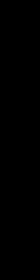

# Generating Doodles with GANs and Quick, Draw!

This repo uses [Generative adversarial networks](https://en.wikipedia.org/wiki/Generative_adversarial_network)
and the [Quick, Draw!](https://quickdraw.withgoogle.com/data) data set to produce
machine learned doodles.

# Examples

## Apples

## The Eiffel Tower

